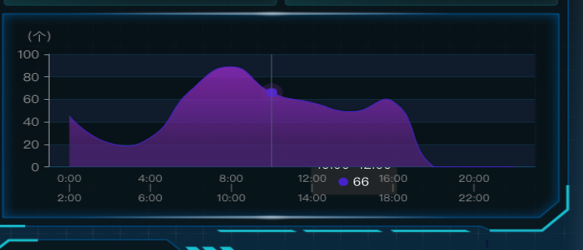
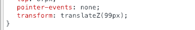
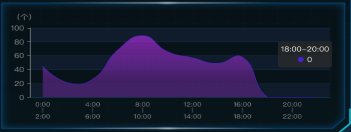

[CSS参考手册](http://css.doyoe.com/)

### css选择器

`*` 通用选择器

`.`class选择器

`#`id选择器

`E` 元素选择器

`E F`包含选择器,选择所有被E元素包含的F元素

`E>F`相邻选择器,选择所有作为E元素的子元素F

`E+F`选择紧贴在E元素之后F元素，元素E与F必须同属一个父级

`E~F`选择E元素后面的所有兄弟元素F，元素E与F必须同属一个父级

`E[att]`选择具有att属性的E元素

`E[att="val"]`选择具有att属性且属性值等于val的E元素

`E[att~="val"]`选择具有att属性且属性值为一用空格分隔的字词列表，其中一个等于val的E元素

`E[att^="val"]`选择具有att属性且属性值为以val开头的字符串的E元素

`E[att$="val"]`选择具有att属性且属性值为以val结尾的字符串的E元素

`E[att*="val"]`	选择具有att属性且属性值为包含val的字符串的E元素

`E[att|="val"]`选择具有att属性且属性值为以val开头并用连接符"-"分隔的字符串的E元素，如果属性值仅为val，也将被选择

`E:link` 设置超链接a在未被访问前的样式。

`E:visited`设置超链接a在其链接地址已被访问过时的样式。

`E:hover`设置元素在其鼠标悬停时的样式。

`E:active`设置元素在被用户激活（在鼠标点击与释放之间发生的事件）时的样式。
`E:focus` 设置元素在成为输入焦点（该元素的onfocus事件发生）时的样式。

`E:lang(fr)`匹配使用特殊语言的E元素。

`E:not(s)`匹配不含有s选择符的元素E。

`E:root`匹配E元素在文档的根元素。

`E:first-child`匹配父元素的第一个子元素E。

`E:last-child`匹配父元素的最后一个子元素E。

`E:only-child`匹配父元素仅有的一个子元素E。

`E:nth-child(n)`匹配父元素的第n个子元素E。

`E:nth-last-child(n)`匹配父元素的倒数第n个子元素E。

`E:first-of-type`匹配父元素下第一个类型为E的子元素。

`E:last-of-type`匹配父元素下的所有E子元素中的倒数第一个。

`E:only-of-type`匹配父元素的所有子元素中唯一的那个子元素E。

`E:nth-of-type(n)`匹配父元素的第n个子元素E。

`E:nth-last-of-type(n)`匹配父元素的倒数第n个子元素E。

`E:empty`匹配没有任何子元素（包括text节点）的元素E。

`E:checked`匹配用户界面上处于选中状态的元素E。(用于input type为radio与checkbox时)

`E:enabled`匹配用户界面上处于可用状态的元素E。

`E:disabled`匹配用户界面上处于禁用状态的元素E。

`E:target`匹配相关URL指向的E元素。


### 语法与规则
`!important`提升指定样式条目的应用优先权。

`@import`指定导入的外部样式表及目标媒体。该规则必须在样式表头部最先声明

`@charset`在外部样式表文件内使用。指定该样式表使用的字符编码。

`@media`指定样式表规则用于指定的媒体类型和条件。

`@font-face`设置嵌入HTML文档的OpenType字体。

`@page`设置页面容器的版式，方向，边空等。

`@keyframes`指定动画名称和动画效果。

`@supports`检测是否支持某特性。

### 函数

`calc()`用于动态计算长度值。

`toggle()`允许子孙元素使用取值序列中的值循环替换继承而来的值。

`attr()` 插入元素的属性值。

`counter()` 插入计数器。

`counters()` 重复插入的计数器。

`image-set()`根据用户设备的分辨率匹配合适的图像。

`linear-gradient()`用线性渐变创建图像。


### 清除图片下出现的几像素的空白间隙

```
img{display:block;}

img{vertical-align:top;}

父元素设置
#test{font-size:0;line-height:0;}
```

### 文本垂直对齐文本框
```
input{vertical-align:middle;}

```

### 单行文本垂直居中
```
#test{height:25px;line-height:25px;}
```

### 文本溢出边界不换行强制在一行内显示
```
#test{width:150px;white-space:nowrap;}
```

### 文本溢出边界显示为省略号
```
#test{width:150px;white-space:nowrap;overflow:hidden;text-overflow:ellipsis;}
```

### 连续的长字符串自动换行
```
#test{width:150px;word-wrap:break-word;}
```
### 如何清除浮动？
```
//#test为浮动元素的下一个兄弟元素
#test{clear:both;}

//#test为浮动元素的父元素。zoom:1也可以替换为固定的width或height
#test{display:block;zoom:1;overflow:hidden;}

//#test为浮动元素的父元素
#test{zoom:1;}
#test:after{display:block;clear:both;visibility:hidden;height:0;content:'';}

```

### 去掉超链接的虚线框
```
a{outline:none;}
```

### 背景透明内容不透明
```html
/*方法1*/
.outer{width:200px;height:200px;background:#000;filter:alpha(opacity=20);opacity:.2;}
.inner{width:200px;height:200px;margin-top:-200px;}

<div class="outer"><!--我是透明的容器--></div>
<div class="inner">我是不透明的内容</div>


/*方法2*/
.outer{
    width:200px;
    height:200px;
    background:rgba(0,0,0,.2)}
.outer .inner{position:relative;}

<div class="outer">
	<div class="inner">我是不透明的内容</div>
</div>
```

### 实现1像素细边框的table

```html
<!--方法1-->
#test{border-collapse:collapse;border:1px solid #ddd;}
#test th,#test td{border:1px solid #ddd;}

<table id="test">
	<tr><th>姓名</th><td>Joy Du</td></tr>
	<tr><th>年龄</th><td>26</td></tr>
</table>

<!--方法2-->
#test{border-spacing:1px;background:#ddd;}
#test tr{background:#fff;}

<table id="test" cellspacing="1">
	<tr><th>姓名</th><td>Joy Du</td></tr>
	<tr><th>年龄</th><td>26</td></tr>
</table>

```

### 垂直水平居中

```css
// 这个实现的方法很多
/*方法一 felx布局*/

.parent{
    width:100px;
    height:100px;
    display:flex;
    align-items:center;
    justify-content:center;
}

/*方法二，position 对于已知宽度的定位**/
.parent{
    width:100px;
    height:100px;
    position:relative;
}
.children{
    width:50px;
    height:50px;
    position:absolute;
    left:50%;
    top:50%;
    margin:-25px 0 0 -25px;
}


/* 方法三，position 未知宽度元素**/

.parent{
    width:100px;
    height:100px;
    position:relative;
}
.children{
    position:absolute;
    left:50%;
    top:50%;
    transform:translate(-50%,-50%)；
    
}

/**已知宽度采用margin实现水平居中**/

.children{
    width:100px;
    height:100px;
    margin:0 auto;
}

/*方法四采用table-cell部件**/

/*绝对定位结合margin: auto，不需要提前知道尺寸，兼容性好*/
.container {
    position: relative;
    height: 300px;
}
.item {
    width: 100px;
    height: 50px;
    position: absolute;
    left: 0;
    top: 0;
    right: 0;
    bottom: 0;
    margin: auto;
}


```


### 浏览器兼容问题
```

```

### 谈一谈浏览器定位问题
```
position:relative|absolute|static|inherit|fixed
```

### 盒模型

标准模式与怪异模式
```
box-sizing :content-box|border-box

content-box :Element width = width + border + padding 
border-box:Element width = width

```

### 移动端的自适应解决方案
```
rem，通过设置根元素的font-size
可以通过js判断或者采用媒体查询
```

### 移动端高清图解决方案
```
不同dpi下加载不同的图片，采用js控制或者采用image-set
```
### 移动端1px问题
```
移动端部分浏览器能识别的最小单位为0.5px，
设置1px通过transform的scale进行缩放
```

### 谈一谈animation

值|	描述
---|---
animation-name|	规定需要绑定到选择器的 keyframe 名称。。
animation-duration|	规定完成动画所花费的时间，以秒或毫秒计。
animation-timing-function|	规定动画的速度曲线。
animation-delay	|规定在动画开始之前的延迟。
animation-iteration-count|	规定动画应该播放的次数。
animation-direction|	规定是否应该轮流反向播放动画。

```
div
{
    animation: myfirst 5s;
    -moz-animation: myfirst 5s;	/* Firefox */
    -webkit-animation: myfirst 5s;	/* Safari 和 Chrome */
    -o-animation: myfirst 5s;	/* Opera */
}
@keyframes myfirst
{
    0%   {background: red; left:0px; top:0px;}
    25%  {background: yellow; left:200px; top:0px;}
    50%  {background: blue; left:200px; top:200px;}
    75%  {background: green; left:0px; top:200px;}
    100% {background: red; left:0px; top:0px;}
}
```

### 当Z-index遇上transform
在给元素整体设置transform:scalex(1.2)后，在echarts中的tootip总是会被canvas遮住。无论怎么样设置z-index，都不能生效。

解决办法是添加一个transform:translatez();






### 设置表格列的宽度
```html

table{
    width:500px;
    height:400px;
    table-layout: fixed;
}
<table>
    <colgroup>
        <col width="180">
        <col width="40%">
        <col >
    </colgroup>
    <tbody>
        <tr>
            td*3
        </tr>
    </tbody>
</table>
```
