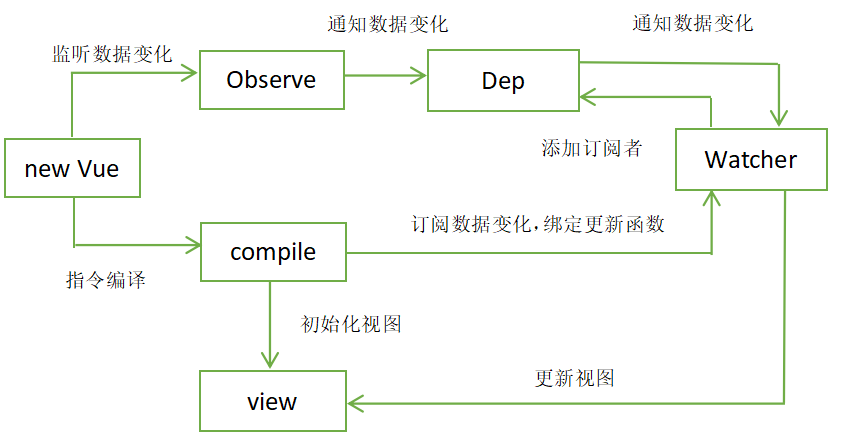

### 介绍

Vue 被设计为可以自底向上逐层应用。Vue 的核心库只关注视图层，不仅易于上手，还便于与第三方库或既有项目整合。另一方面，当与现代化的工具链以及各种支持类库结合使用时，Vue 也完全能够为复杂的单页应用提供驱动。完全的MVVM框架。

[vue官方教程](https://cn.vuejs.org/)

### 知识体系

### Vue如何实现双向数据绑定

#### 简单实现的一个双向数据绑定：
实现双向数据绑定依赖Object.defineProperty()，通过劫持getter与setter完成双向数据绑定

```html
<input id='input' type='text' value='value'>
<p id='text'></p>
<script>
    var input_value='';
    Object.defineProperty(window,'input_value',{
        configurable:true,  //总开关，以第一次设置为准，一旦是false，则其他属性不可设置, 
        enumerbale:true,//决定属性是否可枚举
        set:function(nValue){
            document.querySelector('#input').value=nValue;
            document.querySelector('#text').innerHTML=nValue;
        }
    })
    
    document.querySelector('#input').addEventListener('input',function(e){
        input_value=e.target.value;
    })
</script>

```

#### vue中实现的双向数据绑定

简单的流程图



```js

function observe(obj,vm){
    for(let key in obj){
        defineReactive(vm,key,obj[key);
    }
}

function defineReactive(obj,key,value){
    var dep=new Dep();   //订阅者
    Object.defineProperty(obj,key,{
        get:function(){
            //添加订阅者
            if(Dep.target){
                dep.addSub(Dep.target);
            }
            return value;
        },
        set:function(newValue){
            value=newVal;
            pub.publish(dep);   //发布数据变化通知
        }
    })
}

var pub={
    publish:function(dep){
        dep.notify();
    }
}

function Dep(){
    this.subs=[];
}

Dep.prototype={
    //添加订阅者到dep实例的数组中
    addSub:function(sub){
        this.subs.push(sub);
    }
    //变量订阅者的对象，以此出发各自的更新函数
    notify:function(){
        this.subs.forEach(function(sub){
            sub.update();
        }))
    }
}

//模板编译
function nodeToFragment(node,vm){
    var flag=document.createDocumentFragment();// 创建文档片段
    var child;
    while(child=node.firstChild){
        compile(child,vm);
        flag.append(child);
    }
    return flag;
}

function compile(node,vm){
    var reg=/\{\{(.*)\}\}/;//匹配两个大括号之间的任意值
    //节点类型为元素的节点。表单
    if(node.nodeType===1){
        var attr=node.attributes;
        for(var i=0;i<attr.length;i++){
            if(attr[i].nodeName=='v-mode'){
                var name=attr[i].nodeValue;
                node.addEventListener('input',function(e)=>{
                    vm[name]=e.target.value;
                })
                node.value=vm[name];
                node.removeAttribute('v-model');
            }
        }
    }
    //节点类型文本节点
    if(node.nodeType===3){
    let name=reg.exec(node.nodeValue);
        if(name!=null){
            name=name[1];  //先考虑只有一个变量的情况
            new Watcher(vm,node,name);
        } 
    }
}

function Watcher(vm,node,name){
    Dep.target=this;
    this.name=name;
    this.node=node;
    this.vm=vm;
    this.update();
    Dep.target=null;
}
Watcher.prototype={
    update:function(){
        this.get();
        this.node.nodeValue=this.value;
    },
    get:function(){
        this.value=this.vm[this.name];
    }
}

```

参考:[Vue的双向数据绑定原理](https://www.jianshu.com/p/ed19b36bc324)

### Vue虚拟Dom的实现


### vue中的diff算法

### v-model语法糖的实现

```html
父组件:
parent.vue
<template>
    <div>
        <children v-model="value"></children>
    </div>
</template>

import children from './children.vue';

export default{
    name:'parent',
    components:{
        children,
    }
    data:{
        value:'1234',
    }
}


子组件
children.vue

<template>
    <div>
        <input @input='input_value_change'></input>
    </div>
</template

export default{
    name:'children',
    props:{
        value:{
            type:String,
            default:''
        }
    },
    data(){
        return{
            input_value:'',
        }
    },
    mounted(){
        this.input_value=this.value;
    },
    methods:{
        input_value_change(){
            this.$emit('input',e.target.value);
        }
    },
    wath:{
        value(nValue){
            this.input_value=this.value;
        }
    }
}

```

### 如何理解Vuex

#### 概念：

  Vuex 是一个专为 Vue.js 应用程序开发的状态管理模式，它采用集中式存储管理应用的所有组件的状态，并以相应的规则保证状态以一种可预测的方式发生变化。

#### 与全局变量的区别

    1. Vuex的状态存储是响应式的，store发生变化，相应的组件也会发生变化。
    2. 不能直接改变store中的状态，必须通过commit显示的提交。方便一些工具跟踪。

#### Satte

```js

//可以通过计算属性直接返回
const Counter = {
  template: `<div>{{ count }}</div>`,
  computed: {
    count () {
      return this.$store.state.count
    }
  }
}

//借助mapState辅助函数
import {mapState} from 'vuex'
export default{
    computed:mapState({
        count:state=>stata.count
    })
}

```

#### Getter 

理解为store的计算属性,会将计算结果缓存起来，依赖发生改变才会重新计算。

```js
const store = new Vuex.Store({
  state: {
    todos: [
      { id: 1, text: '...', done: true },
      { id: 2, text: '...', done: false }
    ]
  },
  getters: {
    doneTodos: state => {
      return state.todos.filter(todo => todo.done)
    }
  }
})


//访问
直接访问或者通过mapGetters

```

#### Mutation 
改变store中状态的唯一方法,处理同步事物

```js
const store = new Vuex.Store({
  state: {
    count: 1
  },
  mutations: {
    increment (state,data) {
      // 变更状态
      state.count+=data
    }
  }
})


//使用，借助mapMuattions

import { mapMutations } from 'vuex'
  methods: {
    ...mapMutations([
      'increment', // 将 `this.increment()` 映射为 `this.$store.commit('increment')`

      // `mapMutations` 也支持载荷：
      'incrementBy' // 将 `this.incrementBy(amount)` 映射为 `this.$store.commit('incrementBy', amount)`
    ]),
    ...mapMutations({
      add: 'increment' // 将 `this.add()` 映射为 `this.$store.commit('increment')`
    })
  }
  
//或者直接使用
this.$store.state.commit('increment',data);

```

#### Action 

类似与Mutation，但是Action提交的是mutation，而不是直接更改状态。Action可以包含异步操作。

```js
const store = new Vuex.Store({
  state: {
    count: 0
  },
  mutations: {
    increment (state) {
      state.count++
    }
  },
  actions: {
    increment (context) {
      context.commit('increment')
    }
  }
})

//使用
//直接使用
this.$store.dispatch('increment').then(res=>{
    
}).catch(error=>{
    
})

//借助mapActions
import { mapActions } from 'vuex'

export default {
  // ...
  methods: {
    ...mapActions([
      'increment', // 将 `this.increment()` 映射为 `this.$store.dispatch('increment')`

      // `mapActions` 也支持载荷：
      'incrementBy' // 将 `this.incrementBy(amount)` 映射为 `this.$store.dispatch('incrementBy', amount)`
    ]),
    ...mapActions({
      add: 'increment' // 将 `this.add()` 映射为 `this.$store.dispatch('increment')`
    })
  }
}
```

#### Module 

将比较大的Store切分成小的模块

vuex更多内容参考[vuex](https://vuex.vuejs.org/zh/installation.html)


### 组件之间如何传递参数，父子组件、兄弟组件、不相干组件
- 父子组件：采用`props`与`emit`传递，

- 祖辈组件与子孙组件采用`inject`与`provide`，

```js
//在祖辈组件中写：
provide() {
    return {
      map_nodeObj: { Vue: this}
      // 提示：provide 和 inject 绑定并不是可响应的。这是刻意为之的。然而，如果你传入了一个可监听的对象，那么其对象的属性还是可响应的。
    }
  },

//子孙组件
inject: {
      Vue: {
        default: ''
      },
    },
    
```
- 采用`Vuex`传递

- 采用`Vue-bus`传递

- 采用全局的一个Vue实例对象进行传递，注意：采用匿名函数跨页面的事件传递不能被手动回收。要回收的话事件传入函数名，在beforeDestory中销毁事件。
```
Vue.$emit('postMessage',data);


Vue.$on('postMessage',(data)=>{
    
    }
)

```

- 借助 `$root` 跟实例属性

- 定义windows的全局变量 【不推荐】


### 如何开发全局组件
```js
// 组件注册
Vue.component('my-component-name', { /* ... */ })

```


### 说说箭头函数与常规函数的区别

主要是this的指向问题，箭头函数不改变this的指向，常规函数时谁调用this指向谁。

### 如何自定义指令

### 动态组件

### computed与watch的区别

[https://cn.vuejs.org/v2/guide/computed.html](https://cn.vuejs.org/v2/guide/computed.html)

### vue-router的2种模式有什么区别，路由如何传参

#### 模式：
历史模式或 hash 模式
历史模式不带#号，会重载页面

#### 传参方式：
```js

//传递参数
//1.动态路径匹配

 {path:'user/:id',component:user},

 this.$route.push({
     path:'/user/1234',
     query:{
         date:'2019'
     }
 })
 
 //使用
 this.$route.params.id
 this.$router.query.date
 
//可以通过props将组建于路由解耦

const User = {
  props: ['id'],
  template: '<div>User {{ id }}</div>'
}
const router = new VueRouter({
  routes: [
    { path: '/user/:id', component: User, props: true },

    // 对于包含命名视图的路由，你必须分别为每个命名视图添加 `props` 选项：
    {
      path: '/user/:id',
      components: { default: User, sidebar: Sidebar },
      props: { default: true, sidebar: false }
    }
  ]
})

```
vue-rouer相关资料[vue-router](https://router.vuejs.org/zh/guide/)


### 如何实现路由懒加载
```js
const Foo = () => import(/* webpackChunkName: "group-foo" */ './Foo.vue')
```

### vue组件中，为什么data对象为一个函数

因为确保每个组件的data都是唯一的，而不是一份对象的引用。

### Vue的生命周期

```
beforeCreate

created

beforeMount

mounted      //

beforeUpdate  //发生在虚拟DOM改变之前

updated     //虚拟DOM改变的时候

activated

deactivated  //keep-alive 组件停用时调用

beforeDestroy

destroyed

errorCaptured    //捕获到子孙组件错误的时候

```
